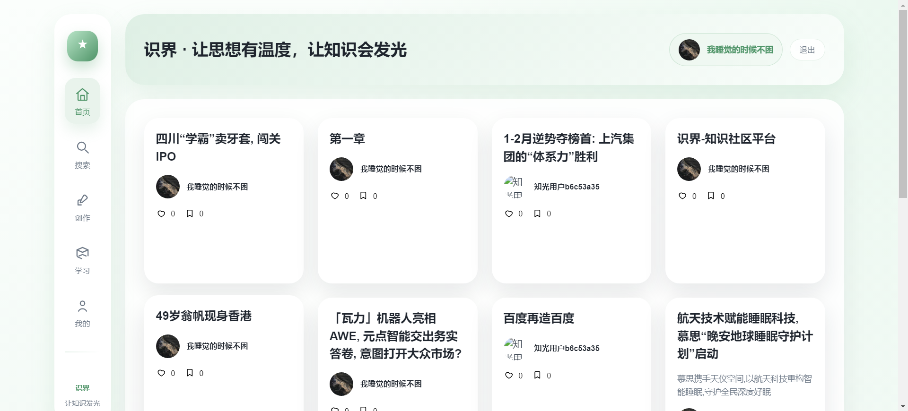
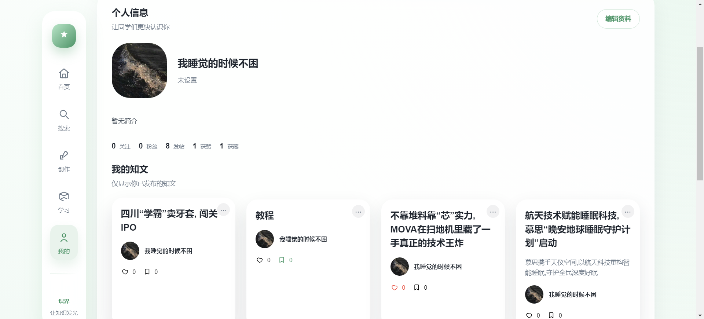

# 识界平台后端

识界平台是一个面向知识获取与分享场景的社区型应用后端，支持用户认证、内容发布、互动关系、Feed 分发能力。

## 项目背景

识界平台定位为知识社区 MVP，目标是提供完整的内容生产与消费闭环：

- 用户可以发布图文内容并进行点赞、收藏、关注等互动。
- 首页通过 Feed 机制进行内容分发，兼顾性能与一致性。
- 搜索模块支持关键词检索与联想建议。

当前后端重点围绕高并发、可扩展、可演进进行设计，核心实践包括：

- 基于 JWT 的双令牌认证体系。
- 基于 Redis + Kafka 的计数与关系异步更新模型。
- 基于 Outbox + CDC 的跨数据源一致性保障策略。

## 技术栈

### 基础框架

- Java 21
- Spring Boot 3.2.4
- Spring Security（OAuth2 Resource Server）
- MyBatis 3.0.3

### 数据与中间件

- MySQL 8.0+
- Redis + Redisson
- Kafka
- Caffeine

### 存储


- 阿里云 OSS SDK

### 其他能力

- Canal Client（CDC / Binlog 订阅）
- Spring Boot Actuator
- JUnit 5 + Mockito

## 快速启动

### 1. 环境准备

请先确保以下依赖可用：

- JDK 21
- Maven 3.8+
- MySQL 8.0+
- Redis
- Kafka

可选依赖：

- 阿里云 OSS（文件存储）

### 2. 初始化数据库

在 MySQL 中创建业务库并执行初始化脚本：

```sql
CREATE DATABASE zhiguang CHARACTER SET utf8mb4 COLLATE utf8mb4_unicode_ci;
USE zhiguang;
SOURCE db/schema.sql;
```

### 3. 配置应用参数

当前 src/main/resources/application.yml 为空，请按你的本地环境补充配置，至少包括：

- spring.datasource.*
- spring.data.redis.*
- spring.elasticsearch.uris
- spring.kafka.bootstrap-servers
- auth.jwt.private-key / auth.jwt.public-key（或对应配置项）
- aliyun.oss.*（如需文件上传）

### 4. 启动服务

在项目根目录执行：

```bash
mvn clean package -DskipTests
mvn spring-boot:run
```

启动成功后，默认访问地址：

- 应用服务：http://localhost:8080
- 健康检查：http://localhost:8080/actuator/health

### 5. 验证接口

可用以下示例请求验证服务联通性：

```bash
curl -X POST http://localhost:8080/api/auth/send-code \
  -H "Content-Type: application/json" \
  -d '{
    "scene": "REGISTER",
    "identifierType": "PHONE",
    "identifier": "13800138000"
  }'
```

## 目录说明

- src/main/java/com/tongji/auth: 认证与鉴权
- src/main/java/com/tongji/knowpost: 内容发布与查询
- src/main/java/com/tongji/relation: 关注关系
- src/main/java/com/tongji/counter: 计数系统
- db/schema.sql: 数据库初始化脚本


## 展示

 

 

